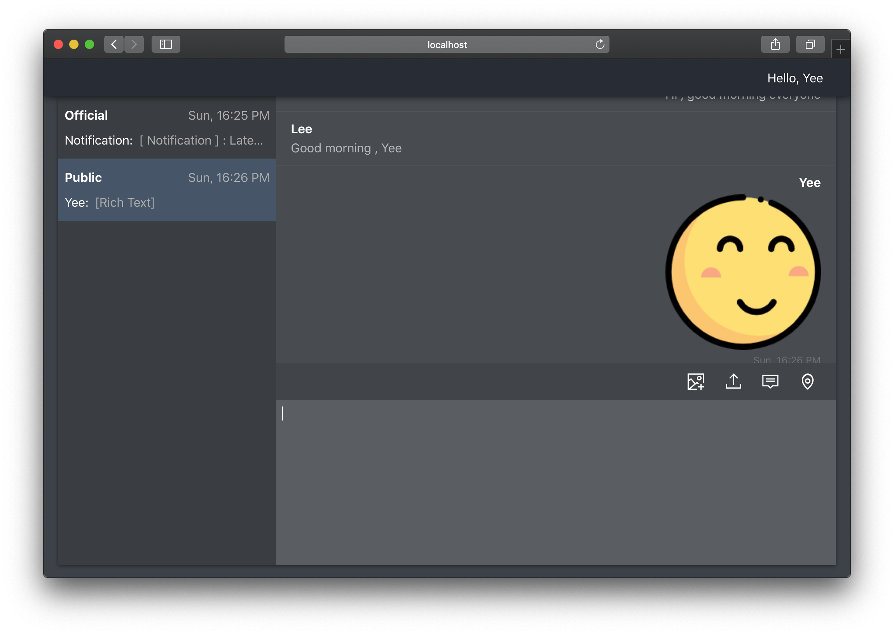

# rim

## Intro

**R**ebuild **I**nstant **M**essager

An online chart room app based on socket.io


## Setup
* Client
    ```bash
    cd client
    npm i
    npm run build
    npm install -g serve
    serve -s build
    ```
* Server
    ```bash
    cd server
    npm i
    node index.js
    ```


## Demo

